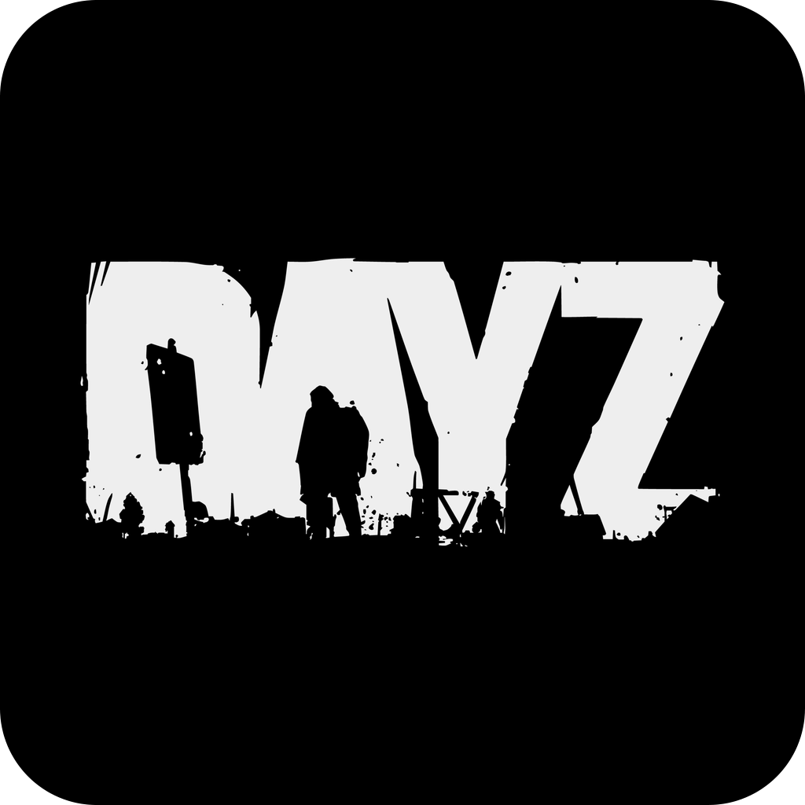
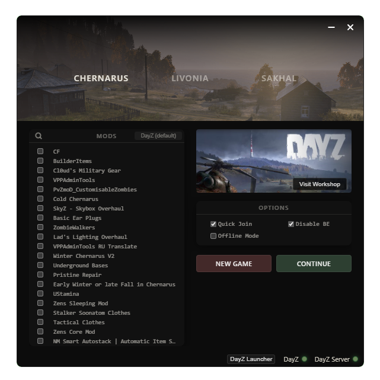

<div align="center">
  
  <h1 align="center">DayZ-SP</h1>
  <p><strong>A lightweight, portable launcher for offline single-player DayZ.</strong></p>

  [](https://opensource.org/licenses/ISC)
  [](https://github.com/huff-dev/DayZ-SP-Launcher/releases)
  [](https://github.com/huff-dev/DayZ-SP-Launcher/stargazers)
</div>

---

<p align="center">
  
</p>

## Requirements

- **DayZ** — You must own the game.
- **DayZ Server** — You must have the "DayZ Server" tool installed (found in your Steam Library under "Tools").

## Features

- **One-Click Launch** — Automatically starts a local DayZ server and game client with pre-configured mods.
- **Mod Management** — Browse Workshop mods, toggle them on/off, and auto-sync.
- **Preset Support** — Import and export presets created using the official DayZ Launcher.
- **Multi-Map Support** — Seamlessly switch between Chernarus, Livonia, and Sakhal with automated save management.
- **Quick Join** — Skips the 15-second login timer.
- **Launche without Steam/Internet**.
- **Disable Anti-cheat and VAC checks**.

## Download

Download the latest portable version from **[Releases](https://github.com/huff-dev/DayZ-SP-Launcher/releases/latest/download/DayZ-SP.exe)**.

## Building from Source

If you want to build the project yourself, ensure you have [Node.js](https://nodejs.org/) installed:

```bash
# Install dependencies
npm install

# Build the portable executable
npm run build
```
The resulting `DayZ-SP.exe` will be available in the `dist/` directory.

## License

This project is licensed under the [ISC License](https://opensource.org/licenses/ISC).
